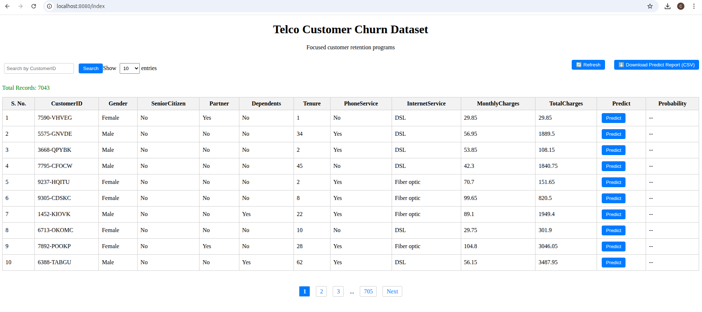

## 🤖 Telco Customer Churn Prediction – Model Overview

This project builds a deep learning model using **Java + DeepLearning4J (DL4J)** to predict whether a telecom customer is likely to churn based on their demographic and service usage data.

### 🎯 Goal

Predict customer churn ("Yes" or "No") using the [Telco Customer Churn dataset](https://www.kaggle.com/datasets/blastchar/telco-customer-churn). This can help businesses take action to retain customers.

### ⚙️ How It Works

- 🧹 Cleans the raw CSV (handles missing values)
- 🧠 Converts text columns to numeric using one-hot encoding
- 📏 Normalizes numeric features like `tenure` and `MonthlyCharges`
- 🏗️ Trains a neural network using DL4J
- 💾 Saves the trained model (`churn-model.zip`) and transformation pipeline (`transformProcess.json`)

### 🧪 Input Features

The model uses 45 input features such as:

- **Demographics:** `gender`, `SeniorCitizen`, `Partner`, `Dependents`
- **Services:** `PhoneService`, `InternetService`, `StreamingTV`, `TechSupport`, etc.
- **Account Info:** `tenure`, `MonthlyCharges`, `TotalCharges`

### 🧠 Model Architecture

| Layer          | Details                            |
|----------------|-------------------------------------|
| Input Layer    | 45 input neurons (one per feature)  |
| Hidden Layer 1 | 32 neurons, ReLU activation         |
| Hidden Layer 2 | 16 neurons, ReLU activation         |
| Output Layer   | 1 neuron, Sigmoid activation        |

- **Loss Function:** Binary Cross-Entropy  
- **Optimizer:** Adam

### 📦 Output

- Returns a **churn probability** (e.g., `0.84`)
- If `probability ≥ 0.5`, prediction is **Churn: Yes**
- Otherwise, **Churn: No**

### 🧾 Explanation

- This reads the whole CSV with `CSVRecordReader`.
- Analyzes and builds a `TransformProcess` to fix empty TotalCharges, convert strings to categorical and one-hot, normalize numerical values.
- Loads all data in one big batch (adjust `batchSize` for your memory).
- Shuffles and splits dataset into train (80%) and test (20%).
- Defines a simple feedforward network with 2 hidden layers.
- Trains for 10 epochs.
- Evaluates model on the test set printing precision, recall, F1 score.
- Saves model to `churn-model.zip`.
- Loads the saved model again to show you how to use it.
- Prints sample prediction outputs.

---

### 📦 Dependencies

- **DataVec:** for data loading, cleaning, and transformation.
- **DL4J:** for building and training the deep learning model.
- **ND4J:** for numerical operations and loss functions (NumPy-like in Java).

#### Mvn repository links:

```plaintext
- DeepLearning4j Core 
https://mvnrepository.com/artifact/org.deeplearning4j/deeplearning4j-core
-ND4J Backend
https://mvnrepository.com/artifact/org.nd4j/nd4j-native-platform
- DataVec for preprocessing
https://mvnrepository.com/artifact/org.datavec/datavec-api
```

### 📥 Step-by-step: Use Kaggle Telco Churn Dataset for DeepLearning4j Model Training

#### 1. Download the Dataset

- Go to: [Kaggle Telco Customer Churn](https://www.kaggle.com/datasets/blastchar/telco-customer-churn)
- Download the CSV file: `WA_Fn-UseC_-Telco-Customer-Churn.csv`
- Place it in your project root folder (where your Java code is)

#### 2. Understand Dataset Columns

Some important columns:

| Column Name       | Description                        |
|-------------------|------------------------------------|
| gender            | Male/Female                        |
| SeniorCitizen     | 0 or 1                             |
| Partner           | Yes/No                             |
| Dependents        | Yes/No                             |
| tenure            | Months customer stayed             |
| PhoneService      | Yes/No                             |
| MultipleLines     | Yes/No/No phone service            |
| InternetService   | DSL/Fiber optic/No                 |
| OnlineSecurity    | Yes/No/No internet service         |
| OnlineBackup      | Yes/No/No internet service         |
| DeviceProtection  | Yes/No/No internet service         |
| TechSupport       | Yes/No/No internet service         |
| StreamingTV       | Yes/No/No internet service         |
| StreamingMovies   | Yes/No/No internet service         |
| Contract          | Month-to-month, One year, Two year |
| PaperlessBilling  | Yes/No                             |
| PaymentMethod     | Electronic check, etc.             |
| MonthlyCharges    | Numeric                            |
| TotalCharges      | Numeric (may have missing data)    |
| Churn             | Yes/No (Target label)              |

#### 3. Data Preprocessing in Java for DeepLearning4j

DeepLearning4j needs numerical input features, so:

- Convert categorical columns to numeric (e.g., Yes=1, No=0)
- Normalize continuous features (`MonthlyCharges`, `TotalCharges`, `tenure`)
- Handle missing values (e.g., fill with average or zero)
- Convert target `Churn` column to 0/1

---

## 🚀 Run the Application

1. Run the `TrainModel` class to generate and save the model and transform process.
2. Run the Spring Boot app (`mvn spring-boot:run` or run your main app class).
3. Use Postman or `curl` to send POST requests to:

```
POST http://localhost:8080/api/predict
Content-Type: application/json

{
  "customerID": "0001",
  "gender": "Male",
  "SeniorCitizen": 0,
  "Partner": "Yes",
  "Dependents": "No",
  "tenure": 12,
  "PhoneService": "Yes",
  "MultipleLines": "No",
  "InternetService": "DSL",
  "OnlineSecurity": "Yes",
  "OnlineBackup": "No",
  "DeviceProtection": "Yes",
  "TechSupport": "Yes",
  "StreamingTV": "No",
  "StreamingMovies": "No",
  "Contract": "Month-to-month",
  "PaperlessBilling": "Yes",
  "PaymentMethod": "Electronic check",
  "MonthlyCharges": 70.5,
  "TotalCharges": 820.5,
  "Churn": "No"
}
```

**Response:**
```json
{
  "churn_probability": 0.32,
  "churn": "No"
}
```

---

## 🖥️ UI Overview (`index.html`)

The `index.html` page provides a web-based interface to interact with the Kaggle Telco Customer Churn dataset and the trained DL4J model.

### 🔧 Features

| Feature           | Description |
|------------------|-------------|
| Load Data         | Automatically loads the cleaned dataset and displays it in a table |
| Search Box        | Allows filtering the table by `customerID` |
| Data Table        | Shows customer details like `gender`, `tenure`, `MonthlyCharges`, etc. |
| Predict Button    | Each row has a **Predict** button to generate churn probability |
| Prediction Column | Displays churn result next to each row (e.g., `Churn: Yes (0.8243)`) |



### 🔁 How Prediction Works

1. User clicks "Predict"
2. The row's data is sent to the `/predict` endpoint via JavaScript
3. Backend:
   - Loads `churn-model.zip`
   - Applies `transformProcess.json`
   - Returns churn probability
4. UI updates the result cell with prediction

### 📦 Why use `transformProcess.json`?

- Ensures the **same preprocessing steps** used during training are applied during prediction
- Prevents inconsistencies in data transformation
- Cleaner and less error-prone than re-coding transform logic manually

---

## 📊 Telco Customer Churn Column Reference

### 🧾 Dataset Columns

```
1. customerID
2. gender
3. SeniorCitizen
4. Partner
5. Dependents
6. tenure
7. PhoneService
8. MultipleLines
9. InternetService
10. OnlineSecurity
11. OnlineBackup
12. DeviceProtection
13. TechSupport
14. StreamingTV
15. StreamingMovies
16. Contract
17. PaperlessBilling
18. PaymentMethod
19. MonthlyCharges
20. TotalCharges
21. Churn
```

### ✅ Verified Column Processing

```
1.  customerID           -> REMOVE
2.  gender               -> CATEGORICAL (One-hot)
3.  SeniorCitizen        -> INTEGER (already 0/1)
4.  Partner              -> CATEGORICAL (One-hot)
5.  Dependents           -> CATEGORICAL (One-hot)
6.  tenure               -> INTEGER (OK as-is or normalize)
7.  PhoneService         -> CATEGORICAL (One-hot)
8.  MultipleLines        -> CATEGORICAL (One-hot, has "No phone service")
9.  InternetService      -> CATEGORICAL (One-hot)
10. OnlineSecurity       -> CATEGORICAL (One-hot, has "No internet service")
11. OnlineBackup         -> CATEGORICAL (One-hot)
12. DeviceProtection     -> CATEGORICAL (One-hot)
13. TechSupport          -> CATEGORICAL (One-hot)
14. StreamingTV          -> CATEGORICAL (One-hot)
15. StreamingMovies      -> CATEGORICAL (One-hot)
16. Contract             -> CATEGORICAL (One-hot)
17. PaperlessBilling     -> CATEGORICAL (One-hot)
18. PaymentMethod        -> CATEGORICAL (One-hot)
19. MonthlyCharges       -> DOUBLE (normalize)
20. TotalCharges         -> STRING → Convert to DOUBLE (normalize)
21. Churn                -> CATEGORICAL → INTEGER (label)
```

---

## Terminology
### 📐 Normalize.Standardize

Z-score normalization:

```
Standardized Value = (x - μ) / σ
```

Where:

- `x` = original value
- `μ` = mean
- `σ` = standard deviation

### 📈 Example: Normalizing `MonthlyCharges`

```
Customer    MonthlyCharges
A           20
B           40
C           100
```

If:
- Mean = 53.3
- Std. Dev = 32.2

Then:

```
Customer    Original    Normalized
A           20          (20 - 53.3) / 32.2 ≈ -1.03
B           40          (40 - 53.3) / 32.2 ≈ -0.41
C           100         (100 - 53.3) / 32.2 ≈ 1.45
```

This helps the model treat all features fairly.

### Epochs:
In the context of machine learning, an epoch refers to one complete pass through the entire training dataset during the training process.

### One-Hot Encoding
When you have categorical data (like "Male" / "Female" or "Yes" / "No"), neural networks can't understand these as strings. They only understand numbers.

But simply converting "Male" to 0 and "Female" to 1 can trick the model into thinking there's a mathematical relationship (like "Female" > "Male"), which isn’t true.

So instead, we use one-hot encoding.

**Before encoding:**

Gender
```
Male
Female
Male
```


After one-hot encoding:
```
gender_Male | gender_Female
------------|---------------
1           | 0
0           | 1
1           | 0
```